# Deep Research Report: Finastra Portfolio, Modules, Customer Evidence, GTM Messaging, and Competitive Context

## Executive summary

Finastra positions itself as a large global financial-services software provider with offerings spanning core/universal banking, lending, payments, digital channels, analytics, and an open platform ecosystem, serving thousands of institutions globally and processing trillions of dollars in transactions daily (per its own published metrics). citeturn1search9turn5search6

Across the portfolio, the most consistently emphasized differentiation themes are: (1) multi-rail modernization for payments (ISO 20022-native hubs, cloud/multi-cloud support, and operational resilience), (2) end-to-end lending lifecycle depth (origination, document/compliance automation, servicing, self-service portals, and ecosystem connectivity), (3) composable/open integration via APIs plus an app marketplace, and (4) data/analytics layers aimed at insight-driven banking and commercial decisioning. citeturn6search2turn4search4turn5search0turn2search6turn2search1turn10search0

A critical portfolio nuance as of 2025–2026: Finastra divested its Treasury & Capital Markets (TCM) division to form **Teciem**, meaning products historically associated with Finastra’s TCM stack (e.g., Kondor, Opics, Summit, Sophis, Fusion Invest, Fusion Risk) are now positioned under Teciem. This matters for diligence, RFP scope, and roadmap assumptions if you are evaluating “Finastra TCM” capabilities today. citeturn1search10turn1search18turn1search3

From a proof standpoint, Finastra publishes a customer-stories hub containing many references and downloadable case studies; in addition, third-party aggregators indicate a broader public footprint of case studies than can be exhaustively enumerated in a single static report. This report compiles and normalizes a **representative, high-signal set** of official customer stories and quantified outcomes that are directly accessible in public sources, and it highlights where the official hub should be used to extend coverage. citeturn7search0turn7search24

For lead generation/value selling, the top “repeatable” use cases that best align to Finastra’s published messaging and measurable ROI patterns are: payment hub consolidation + ISO 20022 migration; cloud-first payments-as-a-service for mid-tier banks; loan servicing automation and ecosystem connectivity around Loan IQ; trade finance modernization + interoperability (including Trade Innovation Nexus); retail/commercial origination digitization (Originate + Mortgagebot + LaserPro); and compliance automation packages (e.g., instant payments compliance services; sanctions screening; DFA 1071/Compliance Reporter modules). citeturn6search2turn4search3turn19search1turn4search2turn4search26turn5search1turn16search21turn19search3

## Portfolio map and solution architecture

Finastra’s current primary solution navigation clusters offerings into: **Lending & Corporate Banking**, **Payments**, **Universal Banking**, and **US Mid-Market**, with an **open platform** (FusionFabric.cloud) plus a marketplace/app-discovery layer. citeturn2search0turn2search9turn2search6turn10search19

image_group{"layout":"carousel","aspect_ratio":"16:9","query":["Finastra Global PAYplus payments hub","Finastra Loan IQ platform interface","Finastra FusionFabric.cloud open platform","Finastra Essence core banking platform"],"num_per_query":1}

### Open platform and API posture

FusionFabric.cloud is presented as an open, collaborative developer platform and marketplace that exposes access to Finastra core systems through APIs and datasets, supporting third-party app development and faster onboarding of new capabilities. citeturn2search8turn2search11turn2search13turn8search6

From the platform’s own developer documentation, key operational constraints/realities include: it is a **multi-tenant SaaS** service owned/operated by Finastra; customers are generally not expected to interact with the full internal API set; and the service is **not intended to be installed and run autonomously by customers** (some sub-components may be installed but depend on the central operated instance). citeturn10search17

### Product-to-use-case mapping visualization

```mermaid
flowchart TB
  subgraph Core_and_Digital
    Essence["Essence (core)"]
    Phoenix["Phoenix (US core)"]
    MalauzAI["MalauzAI Digital Banking"]
    FDB["Fusion Digital Banking (consumer/business)"]
    CorpChannels["Corporate Channels + Unified Corporate Portal"]
    Analytics["Essence Analytics / AnalyzerIQ / Fusion Data Cloud"]
  end

  subgraph Lending_and_Trade
    Originate["Originate (consumer/business loans & deposits)"]
    Mortgagebot["Mortgagebot (POS + LOS + integrations)"]
    LaserPro["LaserPro platform (docs/compliance/origination modules)"]
    LoanIQ["Loan IQ (servicing) + Nexus/Build/Transact + Loan Portal"]
    Trade["Trade Innovation + Trade Portal + Nexus (trade interoperability)"]
    ESG["ESG Service (SLL/SLB pricing automation)"]
    DFA1071["DFA 1071 / Compliance Reporter SBDC"]
  end

  subgraph Payments_and_Messaging
    GPP["Global PAYplus (payment hub) + ACH module"]
    PTG["Payments To Go (PaaS payment hub)"]
    FM["Financial Messaging + Total Messaging"]
    Bacs["Bacsactive-IP (UK Bacs/Faster Payments access)"]
    RapidWires["RapidWires (FedLine Direct wire automation)"]
    CLS["PAYplus for CLS"]
    ComplianceSvc["Compliance as a Service (instant payments screening/monitoring)"]
    Screening["Total Screening (sanctions/PEP screening)"]
  end

  subgraph Platform_Ecosystem
    FusionFabric["FusionFabric.cloud + App Finder/FusionStore"]
    Connectivity["Payments Connectivity Marketplace (e.g., Mastercard Move, Thunes)"]
  end

  Use1["Use case: Payment hub consolidation & ISO 20022 migration"]
  Use2["Use case: Instant payments enablement (FedNow/RTP/TIPS)"]
  Use3["Use case: Corporate lending STP + borrower self-service"]
  Use4["Use case: Trade finance modernization + digital trade connectivity"]
  Use5["Use case: Digital origination + document/compliance automation"]
  Use6["Use case: Core modernization for digital banks / BaaS builders"]
  Use7["Use case: Data/analytics-driven growth & profitability"]
  Use8["Use case: Financial crime & sanctions screening modernization"]

  GPP --> Use1
  FM --> Use1
  PTG --> Use2
  ComplianceSvc --> Use2
  LoanIQ --> Use3
  CorpChannels --> Use3
  Trade --> Use4
  Originate --> Use5
  Mortgagebot --> Use5
  LaserPro --> Use5
  Essence --> Use6
  FusionFabric --> Use6
  Analytics --> Use7
  Screening --> Use8
  Connectivity --> Use2
```



## Detailed product tables across the portfolio

This section focuses on **publicly marketed and evidenced** products/solutions (2024–2026 pages, brochures, press releases, and official factsheets), plus a structured note on the **long-tail supported portfolio** visible via Finastra’s customer-support selector. citeturn18search7turn2search4

### Core banking, digital channels, and analytics

| Product/solution | Concise description | Target segments | Primary use cases | Key features/benefits | Deployment options | Pricing model (public) | Integrations/APIs | Known limitations / risks | Primary sources |
|---|---|---|---|---|---|---|---|---|---|
| Essence | Universal banking/core platform combining broad banking functionality with modern technology for evolving banking models. citeturn0search16turn3search12 | Banks building/modernizing retail & universal banking; includes digital-first/new entrants and established institutions (global positioning). citeturn3search12turn0search16 | Digital core modernization, product configuration, deposits/lending/payments operations, multi-currency and workflow-driven banking. citeturn0search16turn3search12 | Emphasis on rich core functionality + advanced tech; positioned with open APIs/event streaming for real-time experiences. citeturn0search16turn2search10turn2search1 | On-prem and cloud offerings are described across materials; Azure marketplace listing also positions “Essence in the cloud.” citeturn2search18turn8search22 | Not publicly listed; typically sales/quote driven. citeturn3search12turn8search22 | API enablement and openness are repeatedly emphasized; integration with FusionFabric.cloud noted. citeturn2search10turn2search8turn2search11 | Core conversions are inherently high-risk (data migration, process change); diligence should validate roadmap and ecosystem dependencies; analyst recognition is promotional but does not substitute for fit testing. citeturn3search12turn3search0turn3search21 | citeturn0search16turn3search12turn2search18turn3search21 |
| Essence Analytics | Analytics layer for insight-driven banking (dashboards, predictive models, AI-ready foundation) aligned to Essence data/operations. citeturn2search1turn10search15 | Banks using/considering Essence; business users needing role dashboards and predictive insight. citeturn2search1turn10search15 | Real-time visibility, predictive intelligence (e.g., churn/next-best product), performance tracking, risk/compliance oversight. citeturn2search1turn10search15 | Highlights include curated banking data model and an “AI-ready foundation” (Power BI/Azure Databricks referenced). citeturn2search1turn10search15 | “Cloud-first” positioning. citeturn2search1turn10search15 | Not publicly listed; typically quote-based. citeturn2search1turn10search15 | Integrates with Essence and third-party AI via APIs/events. citeturn2search1turn10search15 | Analytics success depends on data quality, governance, and adoption; validate scope of prebuilt models/dashboards and integration effort. citeturn2search1turn10search0 | citeturn2search1turn10search15turn10search0 |
| Phoenix Banking Core | US core banking positioned for community banks/credit unions with open APIs and a 360° view of account holders. citeturn6search0turn6search4 | US community banks and credit unions. citeturn6search4turn6search0 | Core modernization, open banking enablement, operational efficiency, growth scaling. citeturn6search0turn6search20 | “Fully open API architecture” claim; emphasizes real-time access to customer exposure and entitlements. citeturn6search0turn6search20 | Both in-house (on-prem) and outsourced/hosted deployment guidance exists in Phoenix infrastructure docs. citeturn1search19turn17search31 | Not publicly listed; typically quote-based. citeturn6search0turn6search4 | Open APIs emphasized; ecosystem partner integrations are also referenced in press releases around migrations. citeturn6search0turn17search34 | Implementation constraints can be practical (e.g., infrastructure requirements; operational dependencies); validate any embedded limits for ancillary components in your target deployment. citeturn1search19turn17search31 | citeturn6search0turn6search4turn17search31 |
| MalauzAI Digital Banking | Digital banking platform (mobile/web) for next-gen experience and fast updates, positioned for the US mid-market. citeturn5search3turn5search7turn5search23 | US community banks and credit unions; acquired Malauzai historically positioned in this market. citeturn5search23turn5search3 | Consumer and business digital banking UX modernization; faster feature rollouts; cross-device consistency. citeturn5search3turn5search15 | Highlights include unified development approach and open architecture; emphasis on security and engagement. citeturn5search3turn5search23 | Delivered as digital platform (SaaS-style positioning implied by product posture); validate with sales for exact model. citeturn5search3turn5search23 | Not publicly listed. citeturn5search3turn5search23 | Open architecture/integration emphasized; ecosystem language common. citeturn5search3turn16search14 | Digital-channel success depends on integration, UX governance, and releases; confirm roadmap vs. older “Fusion Digital Banking” line items. citeturn16search15turn5search3 | citeturn5search3turn5search23turn16search15 |
| AnalyzerIQ | Business intelligence for community banks/credit unions: customer segments, product profitability, branch performance. citeturn2search5turn10search13turn10search25 | US community banks and credit unions. citeturn2search5turn10search25 | Profitability analytics, segmentation, campaign and channel management measurement. citeturn2search5turn10search7 | Positioned to turn raw data into actionable insights for acquisition/engagement/profitability. citeturn10search25turn10search7 | Cloud-delivered posture implied; validate specific deployment. citeturn2search5turn10search25 | Not public. citeturn2search5turn10search25 | Integrations not exhaustively specified; typical BI depends on core/digital feeds; validate connectors. citeturn2search5turn10search25 | Risks: data mapping effort, adoption and governance; ensure KPI definitions align to finance/ALM reporting if used operationally. citeturn2search5turn10search25 | citeturn2search5turn10search7turn10search25 |
| Fusion Data Cloud | Data platform for simplified access, scalable sharing with fintechs, and faster development of data solutions; positioned as Azure-supported and linked to the open platform. citeturn10search2turn10search0turn2search13 | Financial institutions and fintech ecosystem building data products around Finastra systems. citeturn10search2turn10search6 | Data sharing/ingestion, data solutions development “in weeks,” analytics enablement and innovation. citeturn10search2turn10search0 | Ecosystem framing and pre-integration with core products emphasized. citeturn10search2turn10search6 | Cloud (Azure-supported) positioning. citeturn10search2turn10search0 | Not public. citeturn10search2turn10search0 | Underpinned by FusionFabric.cloud in official release language. citeturn10search2turn2search13 | Risks: data-governance/legal constraints for data sharing; architectural fit vs existing lakehouse. citeturn10search2turn10search17 | citeturn10search0turn10search2turn10search17 |
| Finastra ECM | Enterprise content management platform to digitize paperwork and improve operational productivity. citeturn5search31turn5search7 | US mid-market banks/credit unions. citeturn5search31turn5search7 | Document digitization, centralized storage, operational workflow efficiency. citeturn5search31turn17search34 | “Single scalable solution” messaging. citeturn5search31turn17search34 | Not fully specified publicly; validate hosted vs in-house. citeturn5search31turn17search34 | Not public. citeturn5search31turn17search34 | Integration likely with core/process tools; a migration press release references ECM and item processing in a broader migration suite. citeturn17search34 | Risks: content migration, retention policies, and integration into line-of-business processes. citeturn5search31turn17search34 | citeturn5search31turn17search34 |

### Corporate lending, origination, trade finance, and corporate digital channels

| Product/solution | Concise description | Target segments | Primary use cases | Key features/benefits | Deployment options | Pricing model (public) | Integrations/APIs | Known limitations / risks | Primary sources |
|---|---|---|---|---|---|---|---|---|---|
| Loan IQ | Commercial loan servicing platform positioned for complex syndicated and bilateral lending, end-to-end lifecycle operations. citeturn4search4turn19search21turn3search8 | Large/global banks and complex commercial lenders; also supports SME/bilateral via Simplified Servicing. citeturn4search4turn4search8turn3search8 | Syndicated servicing, accounting, lifecycle events, consolidation of lending operations. citeturn4search4turn19search21 | Automation + end-to-end control; positioned as market-leading. citeturn4search4turn19search21 | Varies (on-prem/managed/hybrid patterns across enterprise lending portfolios); specific managed model referenced via Lending Cloud Service. citeturn5search24turn4search4 | Not public. citeturn4search4turn3search8 | SDK and integration layers exist historically; modern emphasis on APIs via Nexus/Transact/Build. citeturn4search32turn19search0turn19search1 | User-reported limitation: not “fully customizable” in at least one Gartner Peer Insights review; also typical enterprise complexity/implementation risk. citeturn3search2turn4search12 | citeturn4search4turn19search21turn3search2 |
| Loan IQ Nexus | Integration layer to foster interoperability/connectivity across internal/external market platforms for lending ecosystems. citeturn19search0turn7search6 | Complex lenders seeking ecosystem connectivity and reduced integration complexity. citeturn19search0turn7search6 | Connected lending, API-led servicing/origination integration, automation. citeturn19search0turn7search6 | Market-facing integration layer; supports straight-through workflows. citeturn19search0turn7search6 | Not specified publicly; integration-layer model. citeturn19search0 | Not public. citeturn19search0 | Connectivity and interoperability are core value proposition. citeturn19search0turn7search6 | Risk: integration programs can sprawl; validate supported API sets, transaction coverage, and governance model. citeturn19search24turn19search0 | citeturn19search0turn7search6turn19search24 |
| Loan IQ Build | Loan onboarding/booking automation with centralized onboarding and system-agnostic integration to upstream origination systems. citeturn4search0turn4search28 | Banks seeking STP onboarding across loan types, including complex structures. citeturn4search0 | Loan boarding, onboarding orchestration, reduction of manual keying. citeturn4search0turn4search28 | “Single point of entry,” flexible mapping, API-based integration. citeturn4search0turn4search28 | Not specified publicly; integration module posture. citeturn4search0 | Not public. citeturn4search0 | Open APIs and system-agnostic integration emphasized. citeturn4search0turn4search28 | Risk: onboarding quality depends on upstream data discipline; validate transaction coverage and error handling. citeturn4search0turn19search24 | citeturn4search0turn4search28turn19search24 |
| Loan IQ Transact | Automates servicing events ingestion from any upstream system into Loan IQ via generic APIs and translation layers. citeturn19search1turn19search9 | Lenders with multiple upstream systems or modernization programs requiring servicing automation. citeturn19search1 | STP servicing of lifecycle events (drawdowns, payments, increases, etc.). citeturn19search1turn19search5 | Generic market-facing APIs + Finastra-managed translation/integration. citeturn19search1turn19search5 | Not specified publicly. citeturn19search1 | Not public. citeturn19search1 | Explicitly an integration automation module for APIs. citeturn19search1turn19search9 | Risk: confirm supported transaction set/versioning and change management. citeturn19search5turn19search24 | citeturn19search1turn19search5turn19search24 |
| Loan Portal | Borrower self-service portal with real-time Loan IQ data and omni-channel features, positioned to improve loyalty and reduce servicing load. citeturn9search6turn9search2 | Corporate lenders and their corporate borrowers. citeturn9search6turn9search2 | Borrower transparency, transaction initiation, secure comms, reduced RM/back-office burden. citeturn9search6turn9search2 | Personalized dashboards; real-time loan data; omni-channel and API connectivity. citeturn9search6turn9search2 | Not explicitly stated; portal solution. citeturn9search6turn9search2 | Not public. citeturn9search6 | Integrates with Loan IQ out-of-the-box, via Corporate Channels framework and APIs. citeturn9search2turn9search15 | Risk: portal adoption and entitlements integration; validate features by region and host-to-host needs. citeturn9search2turn9search15 | citeturn9search6turn9search2turn9search15 |
| Originate (consumer & business loans/deposits) | Unified, compliant platform for multi-channel loan/deposit applications with workflow automation and decisioning. citeturn4search1turn4search21turn4search25 | Banks and FIs digitizing consumer and SMB origination and account opening. citeturn4search21turn4search25 | Account opening, loan application completion, e-sign, document upload, funding. citeturn4search25turn4search13 | Real-time decisioning; multi-channel consistency; includes Mortgagebot capabilities in broader Originate materials. citeturn4search37turn4search13 | SaaS hosted in Azure is explicitly stated in the consumer deposits factsheet. citeturn4search25 | Not public. citeturn4search21turn4search25 | Integrations implied with downstream systems; MortgagebotLOS integration described in Mortgagebot materials. citeturn5search9turn4search13 | Risk: KYC/identity/fraud and integration scope; validate modularity and time-to-implement assumptions. citeturn4search13turn4search25 | citeturn4search1turn4search25turn4search13 |
| MortgagebotLOS + Originate Mortgagebot + Integrations | Cloud-native mortgage LOS plus POS and integration set to streamline mortgage lifecycle end-to-end. citeturn5search1turn5search13turn5search37 | Retail/wholesale/correspondent mortgage lenders (US emphasis). citeturn5search1turn5search9 | Mortgage application experience, processing/closing, data flow reduction. citeturn5search9turn5search37 | Configurable workflows, compliance capabilities, and POS-to-LOS flow. citeturn5search9turn5search1 | Cloud-native for MortgagebotLOS is explicit. citeturn5search1 | Not public. citeturn5search1turn5search9 | Dedicated integrations offering is published. citeturn5search37turn5search9 | Risk: integration breadth, regulatory change management, and operational resilience across cyclical mortgage demand. citeturn5search9turn5search1 | citeturn5search1turn5search9turn5search37 |
| LaserPro (platform + modules including Conductor/Evaluate) | Lending platform for documentation/compliance plus modular origination components and workflow automation. citeturn5search0turn20search34turn20search0turn20search1 | Community lenders, banks, credit unions; commercial/consumer/mortgage lending. citeturn5search0turn20search13 | Loan documentation generation, compliance checks, commercial origination modernization, document review/approval collaboration. citeturn5search0turn20search0turn20search14 | LaserPro Conductor streamlines doc review and approvals; Evaluate positioned as cloud-native commercial origination replacing spreadsheets/manual processes. citeturn20search0turn20search1turn20search14 | LaserPro cloud strategy is explicit in press; Evaluate is cloud-native; overall platform is cloud modular. citeturn5search12turn20search1turn20search34 | Not public. citeturn5search0turn20search1 | APIs/connectivity highlighted (e.g., cloud connect API references in partner story context); platform supports third-party integrations. citeturn7search10turn20search34 | Risk: compliance liability still requires governance; validate SLA, update cadence, and integration with LOS/core. citeturn5search12turn20search34 | citeturn5search0turn20search1turn20search34turn20search0 |
| Trade Innovation + Trade Portal | Trade finance booking engine/platform plus corporate-facing portal to digitize trade transactions (LCs, guarantees, collections). citeturn4search2turn9search12 | Transaction banks and corporate banking groups. citeturn4search2turn7search5 | Trade finance operations modernization, risk visibility, corporate self-service for trade. citeturn4search2turn9search12 | Real-time visibility into transactions/exposures; trade-portal digitization of trade processes. citeturn4search2turn9search12 | Platform posture varies; Nexus adds cloud-ready modular integration. citeturn4search26turn9search11 | Not public. citeturn4search2turn9search12 | API-driven messaging and interoperability emphasized (especially with Nexus). citeturn9search11turn19search16 | Risk: digital trade ecosystem dependencies and interoperability complexity; validate partner adapters and coverage. citeturn19search31turn9search11 | citeturn4search2turn9search12turn9search11turn19search31 |
| Trade Innovation Nexus | Modular integration layer for Trade Innovation with REST APIs, pre-built adapters, and interoperability modules. citeturn4search26turn19search31turn4search18 | Trade finance institutions needing faster integration/onboarding and lifecycle automation. citeturn19search31turn4search30 | Interoperability between bank systems/fintech ecosystem; integration management; data visibility. citeturn4search30turn9search11 | Unified API layer; pre-built adapters; modular “modules” described in factsheet snippet. citeturn19search31turn4search18 | Cloud-ready layer is explicit. citeturn4search30turn4search26 | Not public. citeturn4search26turn4search18 | REST APIs and integration tools are central. citeturn4search30turn19search16 | Risk: adapter availability vs your ecosystem; governance/versioning of APIs. citeturn19search31turn4search18 | citeturn4search26turn4search30turn19search31 |
| Corporate Channels + Unified Corporate Portal + Cash/Trade/Loan portals | Corporate digital banking framework and unified portal concept spanning cash, trade, SCF, lending, and payments visibility. citeturn9search9turn9search15turn9search10 | Corporate/transaction banks serving corporates and SMEs. citeturn9search15turn9search9 | Unified corporate onboarding/navigation; self-service; cross-product servicing. citeturn9search15turn9search10 | Deep-linking across portals; common dashboards and user admin; omni-channel access. citeturn9search15turn9search20 | Not fully specified; portal/framework product set. citeturn9search15turn9search9 | Not public. citeturn9search9turn9search15 | Open API positioning; SDK mentioned in Cash Portal factsheet. citeturn9search28turn9search15 | Risk: entitlements, identity, and cross-product integration complexity; validate UX consistency and operational ownership. citeturn9search15turn9search28 | citeturn9search9turn9search15turn9search28 |
| ESG Service | Cloud-native SaaS to automate sustainability-linked lending/bond pricing adjustments by integrating SPTs into pricing and servicing systems. citeturn19search2turn19search6turn19search18 | Corporate lenders with SLL/SLB portfolios; banks needing automated ESG-linked pricing updates. citeturn19search2turn19search18 | Sustainability-linked pricing automation, margin/fee recalculation, auditability for ESG terms. citeturn19search2turn19search18 | Open API integration; configurable to varied deal structures and formats. citeturn19search2turn19search18 | Cloud-native SaaS is explicit. citeturn19search2turn19search6 | Not public. citeturn19search2turn19search6 | Open APIs and integration with Loan IQ and other servicing systems is explicit. citeturn19search2turn19search6 | Risk: ESG data sourcing and KPI governance; validate calculation rules, audit trails, and exceptions. citeturn19search2turn19search18 | citeturn19search2turn19search18turn19search6 |
| DFA 1071 / Compliance Reporter SBDC | Compliance module to streamline small business data collection, validation, storage, reporting and filing for Section 1071 requirements. citeturn5search32turn19search3turn20search31turn20search27 | US community banks/credit unions and other covered small business lenders. citeturn19search7turn20search27 | Regulatory compliance workflow for 1071 data collection and reporting. citeturn5search32turn19search3 | Cloud-native module built on LaserPro Compliance Reporter; integrates with LaserPro/CreditQuest/DecisionPro/Originate. citeturn19search11turn20search11turn20search31 | Cloud-native is explicit. citeturn19search11turn20search31 | Not public. citeturn20search31turn19search3 | “Integrates seamlessly” with specified retail lending products is stated. citeturn20search11turn19search11 | Risk: evolving regulatory interpretation and firewall requirements; validate data segregation controls and audit processes. citeturn19search7turn20search39 | citeturn20search31turn19search3turn19search11turn20search39 |
| Fusion CreditQuest | Commercial lending credit workflow/risk management suite (portfolio management, underwriting support, reporting), evidenced via customer story and partner descriptions. citeturn20search32turn20search12turn20search2 | Commercial lenders (community/regional focus evidenced). citeturn20search32turn20search12 | Faster decisioning, borrower experience improvement, underwriting workflow efficiency. citeturn20search32turn20search12 | Lender Insights module highlights pipeline and borrower-expectation management. citeturn20search12turn20search5 | Cloud-based capabilities described in older brochure line (integration to Microsoft tools). citeturn20search5turn20search12 | Not public. citeturn20search32turn20search12 | Integration with Microsoft tooling is referenced in brochures; validate current integration posture. citeturn20search5turn20search12 | Risk: product-line maturity vs newer LaserPro Evaluate/Originate; validate roadmap and overlap. citeturn20search34turn20search12 | citeturn20search32turn20search12turn20search5 |

### Payments, messaging, compliance, and connectivity

| Product/solution | Concise description | Target segments | Primary use cases | Key features/benefits | Deployment options | Pricing model (public) | Integrations/APIs | Known limitations / risks | Primary sources |
|---|---|---|---|---|---|---|---|---|---|
| Global PAYplus | Modular, composable, multi-cloud, multi-country, multi-rail, ISO 20022-native payment hub for real-time, high-value, mass, and cross-border payments. citeturn6search2turn6search6turn6search35 | High-tier and enterprise banks modernizing payment hubs. citeturn4search23turn6search2 | Payment hub consolidation; ISO 20022 migration; multi-rail orchestration including ACH/instant/RTGS/cross-border. citeturn6search2turn6search23turn6search19 | Configurable rules engine, pre-certified workflows, API connectivity; promotes high STP rates and reduced TCO via consolidation (solution overview). citeturn6search2turn6search6turn18search30 | Multiple models across on-prem/managed cloud/SaaS are described at the payments portfolio level; Global PAYplus itself is positioned as multi-cloud. citeturn5search6turn6search2turn6search35 | Not public; some third-party directories mention “pricing” categories but not authoritative for enterprise deals. citeturn6search10turn6search2 | API-based connectivity; ACH module launched as part of modernization strategy; integration with multiple rails referenced externally. citeturn6search3turn6search19turn6search23 | Risks: payments modernization is mission-critical; validate regulatory readiness by country/rail, cutover strategy, and resilience. citeturn5search6turn6search2turn6search23 | citeturn6search2turn6search6turn6search3turn5search6 |
| Payments To Go | Payments-as-a-Service (PaaS) route to multi-rail processing positioned as lower cost/risk onboarding for mid-market institutions. citeturn4search3turn4search19turn4search7 | Mid-tier financial institutions; also referenced in payments institutions pages. citeturn4search31turn17search12 | Fast multi-rail enablement; instant payments adoption; payment transformation with managed service model. citeturn4search3turn18search27 | Open API + microservices architecture; marketplace access; analytics and flexible payment rules (factsheet). citeturn4search7turn18search27 | Positioned as cloud-native/managed service model. citeturn4search3turn4search7 | Not public. citeturn4search3turn4search7 | Open APIs emphasized; FedNow certification messaging references a Total Messaging gateway. citeturn18search27turn18search23 | Risks: reliance on managed provider SLAs, scheme coverage by region, operational controls; validate underwriting and exception workflows. citeturn4search7turn18search27 | citeturn4search3turn4search7turn18search27turn18search23 |
| Financial Messaging (incl. Total Messaging positioning) | Messaging workflow engine/gateway for Swift and other market infrastructures; positioned as one of the larger Swift service bureaus and as a platform with embedded microservices (e.g., transformation). citeturn5search2turn18search4turn5search38 | Medium-sized banks, NBFIs, and corporates needing Swift/rail connectivity (per FAQ). citeturn18search4turn5search38 | Swift connectivity, CBPR+/ISO 20022 translation, market-infrastructure gateways, instant-payment connectivity. citeturn18search4turn5search38 | Claims: certified Swift interface program alignment; connectivity to >15 market infrastructures and 30+ rails across multiple countries; partner connectivity to Mastercard Move and Thunes described. citeturn5search38turn17search5 | Payments portfolio states multiple deployment options including SaaS, managed cloud, and on-prem. citeturn5search6turn18search1 | Not public. citeturn18search4turn5search6 | Transformation service embedded as microservice; curated third-party overlay services referenced. citeturn18search4turn5search34turn5search38 | Risks: messaging environments are security-critical; validate Swift CSP controls, data residency, and incident response. citeturn5search34turn18search4 | citeturn18search4turn5search38turn5search34turn5search6 |
| Bacsactive-IP | UK Bacs Direct Credit/Debit processing with Faster Payments access; explicitly SaaS with added modules in a UK gov service-definition doc. citeturn6search1turn6search9turn15view2 | UK organizations and institutions needing Bacs services; marketed as suitable regardless of size/complexity. citeturn6search17turn15view2 | Payroll/supplier payments, Direct Debits/collections, operational automation, error reduction. citeturn6search1turn15view1 | Web-based access, configurable workflows, multi-factor auth options, integration with accounting/ERP and open API module. citeturn15view1turn15view2turn6search13 | SaaS with UK data-center hosting is explicit; availability level 99.5% during operating hours stated in the gov doc. citeturn15view2turn14view2turn14view1 | Subscription-style: “subscribing to our software service” and monthly invoicing language appears; separate pricing doc referenced but not included. citeturn15view2turn14view1turn13view0 | Open API module referenced; multiple add-on modules listed; Confirmation of Payee integrated messaging exists in separate factsheet page. citeturn15view1turn6search21turn6search29 | Risks: UK-only scope, data residency constraints, and reliance on Bacs operational calendars; multi-module configuration governance. citeturn14view2turn15view2turn15view1 | citeturn6search1turn15view2turn14view1turn14view2turn15view1 |
| RapidWires | Packaged wire processing automation for FedLine Direct (Fedwire) in the US. citeturn17search0turn17search4 | US institutions using FedLine Direct for wires. citeturn17search0turn17search4 | Automate inbound/outbound wire flows, exception processing, investigations, and notifications. citeturn17search4turn17search0 | “Out-of-the-box” processing flows and packaged configuration. citeturn17search4turn17search0 | Phoenix deployment guide indicates RapidWires can be “Hosted” and uses a thick client; the same doc snapshot lists a 3,000 wires/month transaction limit in a standard model. citeturn17search31 | Not public. citeturn17search0turn17search4 | Integrations depend on FedLine Direct and internal systems; validate interface patterns. citeturn17search0turn17search4 | Limitation risk: transaction caps in some standard deployments; validate scalability requirements and whether caps apply to your offering tier. citeturn17search31turn17search0 | citeturn17search0turn17search4turn17search31 |
| ACH Module (modern ACH) | Cloud-native ACH processing module launched to replace legacy ACH systems; supports same-day ACH and API-driven operational controls. citeturn6search3turn6search27 | US banks modernizing ACH processing. citeturn6search3turn6search27 | ACH modernization, scaling volumes, integrating fraud/OFAC and operational controls. citeturn6search27turn6search3 | Kafka-based event streaming and cloud-native microservices are cited in external news; Finastra emphasizes forward-compatible architecture and rich APIs. citeturn6search27turn6search3 | Cloud-native posture in messaging. citeturn6search27turn6search3 | Not public. citeturn6search3 | APIs for operational control/integration are explicitly stated. citeturn6search3turn6search27 | Risks: scheme certification and operational risk in cutover; validate batch/file constraints and exception-handling capabilities. citeturn6search3turn6search27 | citeturn6search3turn6search27turn6search19 |
| Compliance as a Service (instant payments) | Pre-packaged compliance screening + AI-powered transaction monitoring for instant payments (FedNow/TIPS) via partners. citeturn16search21turn16search26 | Banks adopting instant payments with heightened financial crime exposure. citeturn16search21turn18search27 | Real-time sanctions screening and transaction monitoring for instant rails; reduce false positives and operational cost. citeturn16search26turn16search21 | Partnered approach: real-time compliance screening by entity["company","Fincom","aml compliance vendor"] and AI monitoring from entity["company","ThetaRay","financial crime analytics"] described in release language. citeturn16search21turn16search30 | Cloud-based is explicit in factsheet positioning. citeturn16search26 | Not public. citeturn16search26turn16search21 | Designed to integrate with payment infrastructures; validate integration patterns with your hub/rails. citeturn16search26turn16search21 | Risks: third-party dependency and model governance; validate explainability, regulatory acceptability, and operational playbooks. citeturn16search26turn18search28 | citeturn16search21turn16search26turn18search28 |
| Total Screening | Sanctions screening solution scanning transactions and customer files against sanctions/PEP lists. citeturn16search17turn16search13 | Banks/corporates needing sanctions/embargo compliance. citeturn16search17turn16search13 | Payment screening, AML compliance workflows, reduction of false positives. citeturn16search13turn16search17 | Supports transaction and customer file screening; emphasizes quality controls. citeturn16search13turn16search17 | Not specified publicly. citeturn16search17turn16search13 | Not public. citeturn16search17turn16search13 | Often positioned alongside payments platforms; validate APIs and embedding options. citeturn18search20turn16search13 | Risks: sanctions list updates and operational burden; validate list coverage and tuning tooling. citeturn16search13turn16search17 | citeturn16search17turn16search13turn18search20 |
| PAYplus for CLS | Settlement services platform for CLS-eligible FX transactions and related workflows (bank notifications, netting, non-CLS currencies). citeturn18search3turn18search6 | Banks participating in CLS settlement. citeturn18search3turn18search6 | CLS processing automation, monitoring, reconciliation, and distribution of notifications. citeturn18search3turn18search6 | Captures/processes messages per CLS rules and distributes to counterparties; promotes automation and growth. citeturn18search3turn18search6 | Not specified publicly. citeturn18search3 | Not public. citeturn18search3 | Integrates with internal systems and third parties (press language). citeturn18search10 | Risk: settlement systems are high-criticality; validate certification posture and operational resilience. citeturn18search3turn18search10 | citeturn18search3turn18search10turn18search6 |

### Post-trade risk and confirmation services

| Product/solution | Concise description | Target segments | Primary use cases | Key features/benefits | Deployment options | Pricing model (public) | Integrations/APIs | Known limitations / risks | Primary sources |
|---|---|---|---|---|---|---|---|---|---|
| Confirmation Matching Service (CMS) | Multi-bank confirmation matching SaaS that automates/de-risks post-trade confirmations; large client base claim on the service page. citeturn17search2turn17search6 | Banks and market participants needing confirmation matching. citeturn17search2turn17search6 | Automated confirmation matching, reduced operational risk, scaling without heavy IT investment. citeturn17search2turn17search6 | SaaS positioning, automation benefits, audit controls referenced in factsheet. citeturn17search2turn17search6 | SaaS is explicit. citeturn17search2turn17search6 | Not public. citeturn17search2turn17search6 | Integrates into trade confirmation workflows; validate supported asset classes and interfaces. citeturn17search2turn17search6 | Risks: operational dependence on SaaS and network participants; validate continuity, data residency, and audit certifications. citeturn17search6turn17search2 | citeturn17search2turn17search6 |

### Treasury & capital markets note

As of the completed divestiture, Finastra directs TCM users to **Teciem** for solutions “Kondor, Summit, Opics, Sophis, Fusion Invest and Fusion Risk,” with continued investment referenced under the new entity; Finastra’s own pages emphasize the historical breadth of TCM reach, but governance/ownership of these products now sits outside Finastra. citeturn1search18turn1search10turn1search3

## Customer case studies, success stories, and measurable outcomes

### Where to find the full official reference library

Finastra publishes an official **Customer Stories** hub with filters by topic (AI/ML, APIs, cloud, customer experience, etc.) that should be treated as the primary index when assembling an exhaustive reference list. citeturn7search0

A third-party aggregator indicates a much larger public count of case studies referencing Finastra than can be normalized manually in one sitting; treat these as supplemental leads that require validation against primary sources. citeturn7search24

### Normalized customer outcomes table (official/public sources with quantified impact)

| Customer | Industry | Problem/context | Finastra solution(s) implemented | Measurable outcomes (as published) | Primary sources |
|---|---|---|---|---|---|
| entity["organization","BNI","indonesian bank"] | Banking (trade finance) | Multi-vendor trade stack and operational friction; sought modernization and faster innovation. citeturn12view1turn12view0 | Trade Innovation | Reported: IDR 1.11B fee income from trade transactions (2024); 36% YoY growth in wholesale transaction-banking volumes (2022–2024); ~25% faster onboarding and ability to offer SLA <3 hours; 10% increase in customer acquisition in the fiscal year referenced. citeturn12view0turn12view1 | citeturn12view0turn12view1 |
| entity["organization","Hoyne Savings Bank","chicago il community bank"] | Banking (community bank; mortgage lending) | Needed digital lending expansion and compliance-ready processes while scaling via acquisition. citeturn12view2turn11view1 | Originate Mortgagebot + MortgagebotLOS + LaserPro | Reported: 74% increase in number of loans issued during first six months of 2020; 56% increase in dollar amount of new loans; implementation support enabled teams “up and running” in one week (per case study narrative). citeturn12view3turn11view1 | citeturn12view3turn11view1turn12view2 |
| entity["organization","Tonik","philippines digital bank"] | Digital banking | Built a digital bank and scaled personalized digital journeys; needed agile scalable core and AI-enabled service. citeturn2search1turn0search13 | Essence (core) + (referenced alongside analytics/AI narrative) | Reported: 94% growth in consumer loan portfolio; 75% of inquiries resolved automatically by AI; 133% YoY increase in loan production; 4.3x increase in operational efficiency (as displayed on Essence Analytics page customer story). citeturn2search1turn0search13 | citeturn2search1turn0search13 |
| entity["organization","ORO Bank","full-reserve bank"] | Digital banking | New venture needing compliant, scalable cloud core and rapid launch to global markets. citeturn7search8turn0search9 | Essence (cloud-based core) | Reported: launched products to global markets in less than six months (implementation + go-live speed emphasized). citeturn7search8turn0search9 | citeturn7search8turn0search9 |
| entity["organization","BKN301 Group","european baas provider"] | BaaS / fintech | Needed a cloud core with strong API connectivity to build and white-label BaaS and payments orchestration across multiple regions. citeturn7search17 | Essence (cloud core) | Reported: deployed/configured/tested and went live with Essence in less than six months (speed-to-market emphasis). citeturn7search17 | citeturn7search17 |
| entity["organization","Vietcombank","vietnam bank"] | Banking (payments modernization) | Legacy payments sprawl; needed consolidation and automation to support digital transformation. citeturn7search2turn0search11 | Global PAYplus | Reported: “nearly 100%” STP for domestic payments and “more than 90%” for cross-border; reduced manual intervention and processing time; consolidated multiple payments services onto a single platform. citeturn7search2turn0search11 | citeturn7search2turn0search11 |
| entity["organization","ING","global bank netherlands"] | Banking (corporate lending) | Sought end-to-end corporate lending transformation and servicing automation at scale. citeturn7search6 | Loan IQ Nexus | Published customer story describes reducing manual work and unlocking scalable innovation across 95% of the portfolio referenced in the story narrative. citeturn7search6 | citeturn7search6 |
| entity["organization","ODDO BHF","european financial group"] | Banking (trade finance) | Legacy replacement and move toward scalable, secure, collaborative digital trade workflows. citeturn7search5 | Trade Innovation | Reported: replaced legacy system “in under 12 months” and moved toward API-driven automation and compliance. citeturn7search5 | citeturn7search5 |
| entity["organization","Consumers Credit Union","michigan credit union"] | Credit union | Needed modernized core for innovation and scale. citeturn0search17 | Fusion Phoenix (core) + listed additional solutions | Reported: asset growth from $320M to $1.1B after converting to Fusion Phoenix (quote in case study). citeturn0search17 | citeturn0search17 |
| entity["organization","American Express","payment network"] | Payments | Modernized global payment services hub for remittances and transformation. citeturn7search1 | Payment services hub (case study document) | Case study emphasizes strategic transformation; quantified metrics are not visible in the excerpted lines used here. citeturn7search1 | citeturn7search1 |
| entity["organization","Lloyds Bank","uk bank"] | Banking (payments) | Payments transformation program citing partnership and payment-processing expertise. citeturn7search3 | Payments modernization partnership (story page) | Qualitative outcomes emphasized on the story landing page; quantify via downloadable materials if required. citeturn7search3 | citeturn7search3 |
| entity["organization","Jefferson Bank","missouri bank"] | Banking | Needed “big bank” grade payment processing technology via managed model. citeturn4search19turn4search31 | Payments To Go | Customer quote emphasizes access to modern payment processing; metrics not stated on the excerpted page portion. citeturn4search19turn4search31 | citeturn4search19turn4search31 |
| entity["organization","VyStar Credit Union","florida credit union"] | Credit union | Wanted to streamline wire processing and improve member/employee experience. citeturn7search18 | Payments To Go | Qualitative outcomes described; story emphasizes open APIs and operational efficiency goals. citeturn7search18 | citeturn7search18 |
| entity["organization","Security State Bank and Trust","fredericksburg tx bank"] | Community banking | Sought more responsive commercial lending and streamlined data entry across expansion. citeturn0search5 | LaserPro + integration via Cloud Connect API with a third-party LOS | Highlights expected outcomes: productivity, reduced manual work, improved accuracy through integration; details are described in the story. citeturn0search5 | citeturn0search5 |
| entity["organization","Abrigo","us banking technology firm"] | Fintech partner | Joint value proposition around digitizing and automating lending management activities. citeturn7search10 | LaserPro Cloud Connect API (partner story) | Partner story emphasizes faster time-to-money and digitization/automation; metrics not stated in excerpt. citeturn7search10 | citeturn7search10 |
| entity["organization","Mada Capital","saudi asset manager"] | Investment management | Fragmented systems and manual workflows across front/middle/back office created operational risk. citeturn7search7 | Fusion Invest (note: now under Teciem divestiture context) | Case study describes consolidation and automation outcomes; quantified metrics require deeper extraction from the full PDF. citeturn7search7turn1search18 | citeturn7search7turn1search18 |

## Common value propositions, ROI drivers, and lead-generation use cases

### Cross-portfolio value propositions that recur in Finastra materials

Operational efficiency via reduced manual intervention and workflow automation is repeatedly tied to measurable levers such as higher STP rates, faster processing, and staff productivity (payments modernization and lending automation narratives). citeturn0search11turn18search30turn19search1turn20search1

Time-to-market and product agility are emphasized through cloud-first delivery, pre-certified workflows/rules engines (payments hubs), and modular integration layers (Loan IQ Nexus and Trade Innovation Nexus). citeturn6search2turn3search6turn19search0turn19search31

Risk and compliance reduction is positioned through sanctions screening, real-time compliance services for instant payments, cloud-delivered compliance modules (e.g., DFA 1071), and post-trade confirmation automation. citeturn16search26turn16search17turn20search31turn17search2

Composable ecosystem strategy shows up as open-API messaging, API-based core openness, and an app marketplace (FusionFabric.cloud/App Finder) plus curated connectivity marketplaces (e.g., cross-border providers integrated via Total Messaging / financial messaging). citeturn2search8turn2search11turn17search25turn18search15turn5search38

### Top 10 prioritized lead-gen use cases

The list below prioritizes (a) breadth of addressable demand, (b) clarity of ROI logic, (c) proof availability (case studies/metrics), and (d) alignment to strategic products currently marketed.

| Priority use case | Best-fit products/modules | Primary buyer personas | Typical pains | ROI drivers and measurable outcomes | Proof anchors |
|---|---|---|---|---|---|
| Payment hub consolidation + ISO 20022 migration | Global PAYplus + Financial Messaging (transformation services) | Head of Payments, CIO, Ops/Run leaders | Fragmented rails, high change cost, ISO 20022 deadlines, operational risk | Fewer interfaces/systems; improved STP; lower TCO; faster onboarding of new rails/schemes | Vietcombank STP uplift; PAYplus ISO 20022-native positioning citeturn7search2turn6search2turn5search34 |
| Instant payments enablement with compliance controls | Payments To Go + Compliance as a Service + Financial Messaging | Payments product head, risk/compliance, COO | Need 24/7 rails with fraud/AML uplift; limited resources | Faster launch; reduced compliance operational cost; reduced false positives; safer 24/7 processing | Compliance-as-a-Service description + FedNow/TIPS focus citeturn16search21turn16search26turn18search27 |
| Wire processing modernization for mid-tier institutions | RapidWires + Payments To Go + Financial Messaging | Payments ops, treasury ops, technology ops | Manual exception load, FedLine Direct complexity | Reduced manual processing; packaged “bank in a box” approach | RapidWires description; deployment constraints to validate citeturn17search0turn17search31 |
| Corporate loan servicing STP and ecosystem connectivity | Loan IQ + Nexus/Transact/Build | Corporate lending ops, CIO, lending transformation lead | Manual servicing events; disconnected upstream systems | Reduced manual keying; automation; scalable portfolio coverage | ING customer story; Transact and Nexus positioning citeturn7search6turn19search1turn19search0 |
| Borrower self-service and multi-product corporate portals | Loan Portal + Corporate Channels + Unified Corporate Portal | Head of Transaction Banking, Corporate Digital, RM leadership | Borrowers demand transparency; RM time on low-value queries | Lower servicing cost; higher loyalty; improved transaction speed | Loan Portal and Unified Corporate Portal factsheets citeturn9search6turn9search15turn9search20 |
| Trade finance modernization + digital trade interoperability | Trade Innovation + Trade Portal + Trade Innovation Nexus | Trade product head, operations, CIO | Paper-heavy workflows; multiple systems; fintech ecosystem fragmentation | Faster onboarding; automation; improved compliance; faster time-to-market | BNI case study; ODDO BHF story; Nexus integration claims citeturn12view1turn7search5turn4search30turn19search31 |
| Digital origination + account opening (consumer/SMB) | Originate (consumer/business) | Retail/SMB lending head, digital channels | Abandonment, slow decisions, manual docs | Faster applications; real-time decisioning; improved CX | Originate factsheets and product pages citeturn4search25turn4search37turn4search13 |
| Mortgage POS/LOS modernization with integrated docs/compliance | MortgagebotLOS + Originate Mortgagebot + LaserPro | Mortgage ops, CIO | Fragmented mortgage tech, compliance complexity | Faster processing/closing, reduced manual steps | Hoyne metrics; MortgagebotLOS platform claims citeturn12view3turn5search1turn5search9 |
| Regulatory compliance automation for US small business lending (DFA 1071) | DFA 1071 / Compliance Reporter SBDC + LaserPro suite integration | Chief Compliance Officer, lending ops | New rule reporting burden, firewall requirements | Reduced manual collection; auditability; lower compliance overhead | DFA 1071 factsheet + launch press citeturn20search31turn20search27turn19search11 |
| Insight-driven growth, profitability, and segmentation | Essence Analytics + AnalyzerIQ + Digital Banking Insights | CMO, product leaders, FP&A | Limited visibility, slow decisions, weak targeting | Increased cross-sell, churn reduction, product profitability improvement | Essence Analytics + AnalyzerIQ positioning; Digital Banking Insights app citeturn2search1turn10search25turn16search8 |

### Value-selling templates and messaging hooks

**Template: “Operational drag → quantified upside → de-risked path.”**  
“When payment/lending/trade operations rely on fragmented systems and manual intervention, unit cost rises and change cycles slow. By consolidating onto an ISO 20022-native hub with configurable rules and pre-certified workflows (or by automating servicing/origination through API-led modules), institutions target higher STP, fewer exceptions, and faster launches—while reducing integration burden through an ecosystem layer.” citeturn6search2turn18search30turn19search1turn19search31

**Template: “Customer experience sells, but control wins.”**  
“Digital self-service portals (borrower and corporate) are positioned to improve transparency and satisfaction, while simultaneously giving internal teams better control over entitlements, workflows, and risk via real-time back-office integration.” citeturn9search6turn9search15turn9search2

**Template: “Compliance is a growth enabler, not a brake.”**  
“For instant payments and new regulatory regimes (e.g., 1071), packaged compliance modules and cloud-native services are framed as a way to launch faster while increasing risk coverage and reducing operational cost.” citeturn16search21turn20search27turn20search31

## Competitive and analyst perspective

### Analyst recognition and market framing

Finastra promotes that **Essence** was recognized as a “Leader” in the entity["organization","Gartner","research and advisory firm"] Magic Quadrant for Retail Core Banking Systems, Europe (2025) via its own reprint/landing page. citeturn3search0turn3search12

Finastra similarly promotes that **Global PAYplus** and **Payments To Go** were recognized as “Leaders” in the 2025 Gartner Magic Quadrant for Banking Payment Hub Platforms (via Finastra’s report landing page). citeturn3search6turn3search9

For digital banking processing platforms, Finastra references and republishes analysis associated with entity["organization","Forrester","research firm"] Wave evaluations; additional independent Forrester content (blog) lists a broad competitive set in the Q4 2024 Digital Banking Processing Platforms evaluation, including Finastra Essence alongside providers such as 10x, FIS, Fiserv Finxact, Infosys Finacle, Intellect Design, Mambu, Oracle, Temenos, Thought Machine, and others. citeturn3search1turn3search21

For US core banking, Finastra states Phoenix was named a top retail core banking system in the US by both Gartner and entity["organization","Celent","financial services research firm"] (per Finastra press release). citeturn3search3turn6search4

### Competitor context by product domain (indicative, not exhaustive)

| Domain | Finastra focal products | Commonly referenced competitor set (examples) | Sources grounding the competitor set |
|---|---|---|---|
| Retail/universal core banking | Essence | entity["company","Temenos","core banking vendor"], entity["company","Infosys Finacle","core banking platform"], entity["company","Oracle","banking suite vendor"], entity["company","Mambu","cloud core banking vendor"], entity["company","Thought Machine","vault core vendor"], entity["company","TCS","banking software vendor"], entity["company","FIS","banking technology vendor"], entity["company","Fiserv","banking technology vendor"] | Forrester Wave Q4 2024 vendor list citeturn3search21 |
| Payment hubs | Global PAYplus, Payments To Go | entity["company","Volante Technologies","payments hub vendor"], entity["company","Icon Solutions","payments technology vendor"], plus large core vendors’ payment-hub offerings | Omdia Universe payment hubs provider list (paywalled evaluation page still lists vendors) citeturn6search26 |
| Digital banking engagement | MalauzAI / Fusion Digital Banking | entity["company","Backbase","digital banking platform vendor"], entity["company","Q2","digital banking vendor"], entity["company","Alkami","digital banking platform vendor"] | Competitive sets are commonly seen in digital engagement evaluations; Forrester digital engagement PDF indicates Finastra as a contender in Q3 2019 engagement platforms. citeturn3search34 |
| Corporate lending servicing | Loan IQ | Competitors vary by bank segment; ecosystem includes LOS and servicing platforms; borrower portals and integration layers also compete with in-house build and specialized vendors | Loan IQ presence and market descriptions; peer insights reference (opinions). citeturn3search8turn3search2 |
| Trade finance platforms | Trade Innovation + portals + Nexus | Competitive landscape typically includes specialized trade-finance vendors and bank-built stacks; comparisons are often RFP-specific | Finastra trade product materials provide capability posture rather than competitor naming. citeturn4search2turn4search30turn19search31 |

## Timeline and portfolio evolution

Finastra states it was formed in 2017 by integration of entity["company","Misys","banking software vendor"] and entity["company","D+H","canadian fintech provider"] under entity["company","Vista Equity Partners","private equity firm"]. citeturn8search1turn8search7turn8search2

Selected milestones with direct implications for portfolio and roadmap assessment:

```mermaid
gantt
  dateFormat  YYYY-MM-DD
  title Selected Finastra portfolio milestones (publicly reported)

  section Company formation and platform
  Finastra formed (Misys + D+H) : milestone, 2017-06-14, 1d
  FusionFabric.cloud early adopters milestone : milestone, 2017-07-26, 1d

  section Portfolio expansion / acquisitions
  Acquire Malauzai (digital banking, US) : milestone, 2018-06-18, 1d
  Acquire Olfa Soft (eFX platform) : milestone, 2018-01-30, 1d

  section Data and modernization initiatives
  Launch Fusion Data Cloud : milestone, 2020-10-26, 1d

  section Divestitures / structural changes
  Rights to Fusion Summit business acquired by Hundsun group entity : milestone, 2021-12-02, 1d
  Announce sale of Treasury & Capital Markets division to Apax : milestone, 2025-05-19, 1d
  TCM divestiture completed; Teciem formed : milestone, 2025-??-??, 1d

  section Newer product initiatives
  Launch modern ACH module : milestone, 2025-09-23, 1d
  Trade Innovation Nexus announced at Sibos 2025 : milestone, 2025-09-30, 1d
```

The milestone dates above are directly supported by Finastra press pages (and related official notices) for formation and major launches, plus Finastra disclosures regarding TCM divestiture and the Summit business transfer. citeturn8search7turn8search6turn5search23turn1search20turn10search2turn1search8turn1search10turn1search18turn6search3turn4search30

## Recommended GTM assets, ROI modules, and demo-script outlines

### High-value “assets to lead with” (official, one-pager style)

To build a scalable demand-gen and value-selling library, the following official artifacts map cleanly to the highest-converting use cases:

- **Payments modernization**: Global PAYplus solution overview and payment-hubs positioning (ISO 20022, multi-rail), plus Financial Messaging brochures and transformation-service materials. citeturn6search38turn6search6turn18search30turn5search34turn5search30  
- **Payments To Go**: PaaS factsheets and FedNow certification narratives for instant-payments enablement. citeturn4search7turn18search27turn4search19  
- **Trade finance**: Trade Portal factsheet and Trade Innovation Nexus factsheet/press release to sell interoperability and time-to-market. citeturn9search12turn4search18turn4search30turn19search31  
- **Corporate self-service portals**: Loan Portal factsheet and Unified Corporate Portal factsheet to sell cross-product corporate digital engagement. citeturn9search20turn9search15turn9search2  
- **Lending lifecycle modernization**: Loan IQ Build/Transact/Nexus product pages and “What’s new” updates to prove continued platform investment. citeturn4search0turn19search1turn19search0turn19search24  
- **Retail lending compliance/origination**: LaserPro Lending Platform/Conductor assets and DFA 1071/Compliance Reporter factsheets. citeturn20search34turn20search3turn20search31turn20search27  
- **Core + analytics**: Essence and Essence Analytics pages plus customer metrics tiles (Tonik story). citeturn3search12turn2search1turn0search13  

### ROI calculator modules (recommended structure)

A practical ROI calculator library (one per top use case) should mirror the metrics Finastra highlights in case studies and product claims:

- **Payments hub ROI**: baseline exception rate + manual repair cost + number of rails/schemes + ISO 20022 migration cost avoidance; tie to STP improvements (e.g., “near 100% domestic STP” patterns seen in Global PAYplus case studies). citeturn0search11turn18search30turn6search6  
- **Loan servicing automation ROI**: manual keying time per lifecycle event, error rate, rework cost, and time-to-board; map to Transact/Build automation and system-agnostic connectivity messaging. citeturn19search1turn4search0turn7search6  
- **Trade finance ROI**: onboarding cycle time, SLA targets, fee-income uplift, productivity per document and compliance checks; anchor with BNI metrics such as onboarding acceleration and trade fee income. citeturn12view0turn12view1  
- **Retail lending/compliance ROI**: document error rate, compliance update effort, origination cycle time, and “spreadsheet/manual workflow” replacement story for LaserPro Evaluate. citeturn20search1turn5search12turn20search14  

### Demo script outlines (recommended)

**Payments hub modernization demo (30–45 minutes)**  
Walk through rail onboarding (ACH/instant/high-value), ISO 20022 message handling, rules configuration, exception workflow, and operational dashboards; close by showing how financial messaging connectivity and transformation services fit into the end-to-end architecture. citeturn6search2turn6search3turn18search4turn5search34

**Corporate lending ecosystem demo**  
Show onboarding (Build), servicing-event ingestion (Transact), API-led integration posture (Nexus), and borrower visibility (Loan Portal) to demonstrate an end-to-end “origination → servicing → borrower experience” chain. citeturn4search0turn19search1turn19search0turn9search6

**Trade modernization + interoperability demo**  
Demonstrate trade booking/processing (Trade Innovation), corporate portal experience (Trade Portal), and how Nexus reduces integration complexity with REST APIs and adapters, emphasizing faster onboarding and lifecycle automation. citeturn4search2turn9search12turn4search30turn19search31

**Retail lending compliance + origination demo**  
Show LaserPro documentation generation and compliance checks; collaborative review/approval via Conductor; then reposition Evaluate as the commercial origination modernization layer designed to replace spreadsheet-based workflows. citeturn5search0turn20search0turn20search1turn20search34